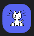
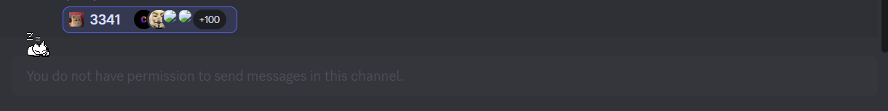
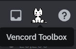
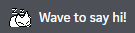

# Onekocord: Oneko for Discord!

Your favourite cat, Oneko, implemented into discord everywhere you wish!

This repository contains all official Oneko skins and code snippets

Only supported on [Vencord](https://vencord.dev), may partly work on [BetterDiscord](https://betterdiscord.app)

## Content
**Onekoanimations**

Onekoanimations.css is needed for all Oneko snippets. It supplies the different animations to the Oneko snippets.

**Onekohomeicon**

An Oneko for your home icon!



**Onekomessagebar**

Oneko on your message input!


**Onekotoolbox**

Replaces the new sleeping Oneko on the Vencordtoolbox with a custom Oneko!



**Onekoavatar** 

Replace your avatar with an interactive Oneko


**Onekowelcome**

Replace the "Wave to say hi!" Sticker with Oneko



## Installation and Customization

Installing Onekocord snippets is as easy as putting the links into your Online themes, downloading the UserCSS files and putting them into your local themes folder or using ```@import url(LINK);``` at the top of your QuickCSS file!


Here are the default variables that are used in the snippets themselves. You can copy any variable you wish to change into your Quickcss to customise your personal Oneko experience.

Experimental animations are technically valid animations, though they might not work as expected.

Valid animations are:
  - alert
  - runright
  - runleft
  - scratchright
  - scratchleft
  - scratchdown
  - scratchup
  - spinleft
  - spinright
  - sleep (EXPERIMENTAL)
  - wakeup (EXPERIMENTAL)
  - gotosleep (EXPERIMENTAL)
  - messagebarwalk (EXPERIMENTAL)

Valid Skins are all the files in the Onekoskins folder, just change default.png in the default variables to whichever you want!

**Onekohomeicon Variables**
```css
:root { /*Onekohomeicon*/
--onekohomeicon-skin: url(https://raw.githubusercontent.com/vencordcss/onekocord/main/onekoskins/default.png);
--onekohomeicon-rendering: pixelated;
--onekohomeicon-wakeup-animation: wakeup;
--onekohomeicon-wakeup-duration: 2s;
--onekohomeicon-sleep-animation: sleep;
--onekohomeicon-sleep-duration: 2s;
--onekohomeicon-hovered-animation: runright;
--onekohomeicon-hovered-duration: 0.3s;
--onekohomeicon-selected-animation: alert;
--onekohomeicon-selected-duration: 0.3s;
--onekohomeicon-scale: 1;
}
```

**Onekomessagebar Variables**
```css
:root { /*Onekomessagebar*/
--onekomessagebar-skin: url(https://raw.githubusercontent.com/vencordcss/onekocord/main/onekoskins/default.png);
--onekomessagebar-rendering: pixelated;
--onekomessagebar-z-index: 1;
--onekomessagebar-position-top: -30px;
--onekomessagebar-position-left: 10px;
--onekomessagebar-wakeup-animation: wakeup;
--onekomessagebar-wakeup-duration: 2s;
--onekomessagebar-sleep-animation: sleep;
--onekomessagebar-sleep-duration: 2s;
--onekomessagebar-hovered-animation: runright;
--onekomessagebar-hovered-duration: 0.3s;
--onekomessagebar-selected-animation: alert;
--onekomessagebar-selected-duration: 0.3s;
--onekomessagebar-scale: 1;
}
```

**Onekotoolbox Variables**
```css
:root { /*Onekotoolbox*/
--onekotoolbox-skin: url(https://raw.githubusercontent.com/vencordcss/onekocord/main/onekoskins/default.png);
--onekotoolbox-rendering: pixelated;
--onekotoolbox-wakeup-animation: wakeup;
--onekotoolbox-wakeup-duration: 2s;
--onekotoolbox-sleep-animation: sleep;
--onekotoolbox-sleep-duration: 2s;
--onekotoolbox-hovered-animation: runright;
--onekotoolbox-hovered-duration: 0.3s;
--onekotoolbox-selected-animation: alert;
--onekotoolbox-selected-duration: 0.3s;
--onekotoolbox-sclae: 1;
}
```

**Onekoavatar Variables**
```css
:root { /*Onekoavatar*/
--onekoavatar-skin: url(https://raw.githubusercontent.com/vencordcss/onekocord/main/onekoskins/default.png);
--onekoavatar-rendering: pixelated;
--onekoavatar-wakeup-animation: wakeup;
--onekoavatar-wakeup-duration: 2s;
--onekoavatar-sleep-animation: sleep;
--onekoavatar-sleep-duration: 2s;
--onekoavatar-hovered-animation: runright;
--onekoavatar-hovered-duration: 0.3s;
--onekoavatar-selected-animation: alert;
--onekoavatar-selected-duration: 0.3s;
--onekoavatar-scale: 1;
}
```

**Onekowelcome Variables**
```css
:root { /*Onekowelcome*/
--onekowelcome-skin: url(https://raw.githubusercontent.com/vencordcss/onekocord/main/onekoskins/default.png);
--onekowelcome-rendering: pixelated;
--onekowelcome-wakeup-animation: wakeup;
--onekowelcome-wakeup-duration: 2s;
--onekowelcome-sleep-animation: sleep;
--onekowelcome-sleep-duration: 2s;
--onekowelcome-hovered-animation: runright;
--onekowelcome-hovered-duration: 0.3s;
--onekowelcome-scale: 1;
}
```

## Contributing and Permissions

If you want to contribute, make sure to open an issue with your idea or code and I will review it and if sufficient, add it to the repository. When this happens for the first time, I will add a space to credit contributers.


Unless otherwise specified, do not distribute the code of this project directly, since it will cause conflicting versions for people, always use a link to raw files or to the repository to refer to Onekocord.
